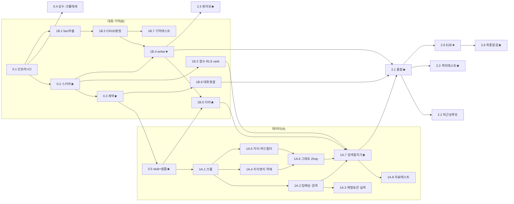

# WBS & TODO — skinmate 구현 작업 분해 (실행용)

> 대상 독자: 이 프로젝트를 이어받아 구현할 LLM/개발자.
> 근거 문서: [team-agreement.md](../team-agreement.md), [skinmate-consensus-plan.md](../skinmate-consensus-plan.md), [deep-interview-skinmate.md](../deep-interview-skinmate.md)
> 함께 읽을 것: [PRD.md](PRD.md)(기능 상세), [ENVIRONMENT.md](ENVIRONMENT.md)(환경·컨벤션), [ACCEPTANCE-TESTING.md](ACCEPTANCE-TESTING.md)(완료기준·테스트)

---

## 0. 이 문서를 읽는 법

- **P0 / P1 / P2** = 우선순위. P0는 여기서 막히면 나머지가 못 나가는 **차단 작업**, P1은 핵심 기능, P2는 부차·조건부.
- **⭐** = 두 작업자 코드가 동시에 의존하는 공유 지점 → 완료·변경 시 상대 합의 필수.
- **선행** = 이 작업 전에 반드시 끝나야 하는 작업 ID.
- 각 작업의 완료 기준·비즈니스 로직은 [PRD.md](PRD.md)와 [ACCEPTANCE-TESTING.md](ACCEPTANCE-TESTING.md)에 상세.

---

## 1. 가장 먼저 해결해야 하는 핵심 (Critical First)

구현 순서를 고민할 때 **아래 3개를 가장 먼저, 가장 정확히** 잡아야 한다. 전부 나중에 되돌리기가 매우 비싼 **아키텍처 불변식**이기 때문이다.

1. **⭐ 단일 트랜잭션 원자 저장 (`writer.py`, AC-S1/S2)** — 표+벡터+그래프를 한 커넥션·한 트랜잭션으로 쓰고 실패 시 전부 롤백. 이 경계를 나중에 끼워넣으려면 저장 경로 전체를 다시 짜야 한다. **1B.4**.
2. **⭐ 사용자 격리 (RLS + choke 단일 관문, AC-M5/G3)** — 개인 데이터에 항상 `user_id`/`user_scope`를 강제. 격리를 사후에 덧대면 누수 구멍을 막기 어렵다. **0.2 + 0.5 + 1B.3 + 1A.6**.
3. **⭐ 2+hop 그래프 순회 (AC-G2)** — 추천의 핵심 추론 방식. 이게 성립해야 시스템의 존재 이유(풍부한 근거)가 성립. **1A.6 + 1B.5(다리)**.

> 즉 "기억을 정확히·격리해서·원자적으로 저장하고, 그것을 그래프로 다단계 순회해 근거를 만든다"가 제품의 심장이다. UI·크롤 커버리지·성능 최적화는 그 다음이다.

---

## 2. 병렬 착수 게이트 (확정)

Phase 0을 전부 끝낼 필요 없이, 아래 세 개가 완료되는 순간 A/B가 병렬로 갈라진다.

```
[0.2 스키마 freeze] + [0.3 계약 + CI 계약테스트] + [0.5 choke/embed stub + 공용 샘플]
        └────────────────────── 병렬 시작 트리거 ──────────────────────┘
0.1(인프라)·0.4(상수·크롤태세)는 위와 겹쳐 진행 가능.
```

---

## 3. WBS

### Phase 0 — 공동 기반

|  ☐  | ID    |  P  | 할 일                                                                                                                                         | 담당                          | 선행  | 완료 조건                |
| :-: | ----- | :-: | ------------------------------------------------------------------------------------------------------------------------------------------- | --------------------------- | --- | -------------------- |
|  ☐  | 0.1   | P0  | 레포 뼈대 + docker-compose(PG16+AGE+pgvector 버전핀) + **CI 파이프라인** + 로컬 bge-m3 로딩 스파이크 + `llm/` 껍데기                                               | 공동                          | —   | 둘 다 로컬 DB 기동 + CI 그린 |
|  ☐  | 0.2 ⭐ | P0  | **테이블 구조 확정→고정**: `db/migrations/001~` (확장·전체 표·RLS·그래프 `skinmate`)                                                                         | A (memories DDL은 B 초안→A 통합) | 0.1 | 양쪽 리뷰 승인, freeze 선언  |
|  ☐  | 0.3 ⭐ | P0  | **데이터 형식(contracts) + 가짜데이터(fixture)**: `RetrievalContext`·`IngredientRef`·`GraphPath`·`fact_type` enum·`RankedFact` + **스텁↔실물 계약테스트를 CI에** | 공동                          | 0.2 | 계약 문서 + CI 계약테스트 통과  |
|  ☐  | 0.4   | P1  | 임베딩 상수 기록(bge-m3/1024, `embedding_model_id`) + 크롤 태세 확정(예의·rate-limit·캐시·출처메타, ToS 비상업)                                                     | A                           | 0.1 | 설계 메모                |
|  ☐  | 0.5 ⭐ | P0  | **조기 납품**: `choke.py`·`embed.py` 인터페이스+최소동작 + 소량 공용 샘플(성분·제품 조금·사용자 2명)                                                                     | A                           | 0.3 | B가 import하여 개발 가능    |

### Phase 1A — 데이터 담당(A)

|  ☐  | ID     |  P  | 할 일                                                          | 선행               | 완료 조건(요약)                        |
| :-: | ------ | :-: | ------------------------------------------------------------ | ---------------- | -------------------------------- |
|  ☐  | 1A.1   | P1  | 크롤러: **coos.kr + Paula's Choice** + INCI 정규화·중복제거            | 0.5              | 실데이터 적재, 출처·수집일시 기록              |
|  ☐  | 1A.2   | P1  | 문서·제품 임베딩→pgvector + 유사도 검색(`documents/search.py`)           | 1A.1             | top-k 유사도 비어있지 않음 (AC-D1)        |
|  ☐  | 1A.3   | P1  | **AC-D1 제형토큰 실측 게이트(≥60%)** → 미달 시 손 보강(=제형 fixture 겸용)      | 1A.2             | 커버리지 측정 리포트 + (필요시) 보강셋          |
|  ☐  | 1A.4   | P1  | 지식 엣지 적재: 문서·크롤에서 `TREATS/AGGRAVATES`·`HELPS/CONFLICTS`를 그래프에 직접 추출·적재 | 0.5, 1A.1        | 그래프 지식 엣지 non-empty              |
|  ☐  | 1A.5   | P1  | 성분→제품 조회 + **회피성분 완전차단 필터**(관계형)                             | 1A.1             | AC-D2/R2                         |
|  ☐  | 1A.6   | P0  | `CONTAINS` projection(product_ingredients) + **2+hop 순회**(지식 엣지는 1A.4) + 경로→근거문장 | 1A.5, 1A.4       | AC-G1/G2                         |
|  ☐  | 1A.7 ⭐ | P1  | **검색 3종 합치기**(벡터+그래프+`rank_memory` 호출) + **제형 soft-ranking** | 1A.2, 1A.6, 1B.5 | `RetrievalContext` 산출 (AC-F1 준비) |
|  ☐  | 1A.8   | P1  | 자료 테스트(AC-D1/D2/G1/G2) — **개발과 병행**                          | 1A.7             | CI 통과                            |
|  ☐  | 1A.9   | P2  | (조건부) 순회 p95 초과 시 경로 read-through 캐시                         | 벤치마크             | 2.6에서 미달 시에만                     |

### Phase 1B — 대화·기억 담당(B)

| ☐ | ID | P | 할 일 | 선행 | 완료 조건(요약) |
|:-:|---|:-:|---|---|---|
| ☐ | 1B.1 | P1 | LLM 껍데기 구현 + fact 추출기(중요도 거르기) | 0.1 | AC-M3 |
| ☐ | 1B.2 | P1 | CRUD 판정기(추가/수정/삭제/무시, delete=soft+감사) | 1B.1 | AC-M1 |
| ☐ | 1B.3 | P0 | 중요도 점수(**λ=0.05**) + 개인격리 저장(RLS) + `rank_memory` 제공 | 0.2 | AC-M2/M5 |
| ☐ | 1B.4 ⭐ | P0 | **`writer.py` 동기 원자 저장**(표+벡터+그래프 한 묶음, 실패 전부취소, advisory lock) | 0.2, 1B.2 | **AC-S1/S2** |
| ☐ | 1B.5 ⭐ | P0 | **기억→그래프 다리**(개인 회피/선호 연결선, choke 경유, writer tx 안) | 1B.4, 0.5 | AC-G2(개인 엣지) |
| ☐ | 1B.6 | P1 | 대화 총괄(구체/모호 분기 + 좁혀가기 퍼널 + 근거 생성) — fixture로 개발 | 0.3 | AC-R1/R3/R4/M4 |
| ☐ | 1B.7 | P1 | 기억 테스트(AC-M1~M6, 중요도 평가셋 ≥20개) — **개발과 병행** | 1B.2 | CI 통과 |

### Phase 2 — 합치고 검증 (공동, 전부 ⭐)

| ☐ | ID | P | 할 일 | 선행 | 확인(AC) |
|:-:|---|:-:|---|---|---|
| ☐ | 2.1 ⭐ | P0 | fixture→진짜 검색 교체 + 배선 통합(대화↔검색↔저장, `app/`) | 1A.7, 1B.6, 1B.4 | 계약 맞물림·AC-M4 |
| ☐ | 2.2 ⭐ | P1 | **최근성 루프**(쓴 즉시 다음 턴 반영, drain 없음) | 2.1 | AC-M6 |
| ☐ | 2.3 ⭐ | P0 | **격리 테스트 0건**(남의 기억·그래프 조회) | 1A.6, 1B.3 | AC-M5/G3 |
| ☐ | 2.4 ⭐ | P0 | **원자성 결함주입 테스트**(그래프 쓴 뒤 커밋 전 실패→3저장 0잔여) | 1B.4 | AC-S1 |
| ☐ | 2.5 ⭐ | P1 | 대표 시나리오 E2E("가을 건조·오일싫음·에멀전") 4단언 통과 | 2.1 | AC-R4 |
| ☐ | 2.6 ⭐ | P1 | 최종 점검: 회피 0건·근거 단언 정합·제형 랭킹 + 성능 예산(AGE 순회·p95) | 2.5 | AC-R2/R3/F1·예산 |

---

## 4. 의존 그래프



**임계경로:** `0.1 → 0.2 → 0.3 → 0.5 → (B: 1B.3→1B.4→1B.5) + (A: 1A.1→1A.2→1A.6→1A.7) → 2.1 → 2.3/2.4 → 2.5 → 2.6`

**교차 의존 2곳(트랙 사이 유일한 연결):**
1. `1A.7 ← 1B.3/1B.5` — 검색 합치기가 B의 `rank_memory`와 개인 그래프 엣지를 필요로 함(⭐6).
2. `1B.5 ← 0.5` — 다리가 choke stub + 공용 샘플 성분을 필요로 함(⭐5).

---

## 5. 합의(동기화) 지점 요약

- **시작할 때(P0):** 0.2 스키마 · 0.3 계약 · 0.5 stub/샘플 → 이후 변경 시 상대 승인.
- **중간에:** 1B.3 memories/RLS(A의 마이그레이션에 포함) · 1A.7↔1B.5 교차 계약.
- **합칠 때:** 2.1~2.6 전부 페어로 진행.
